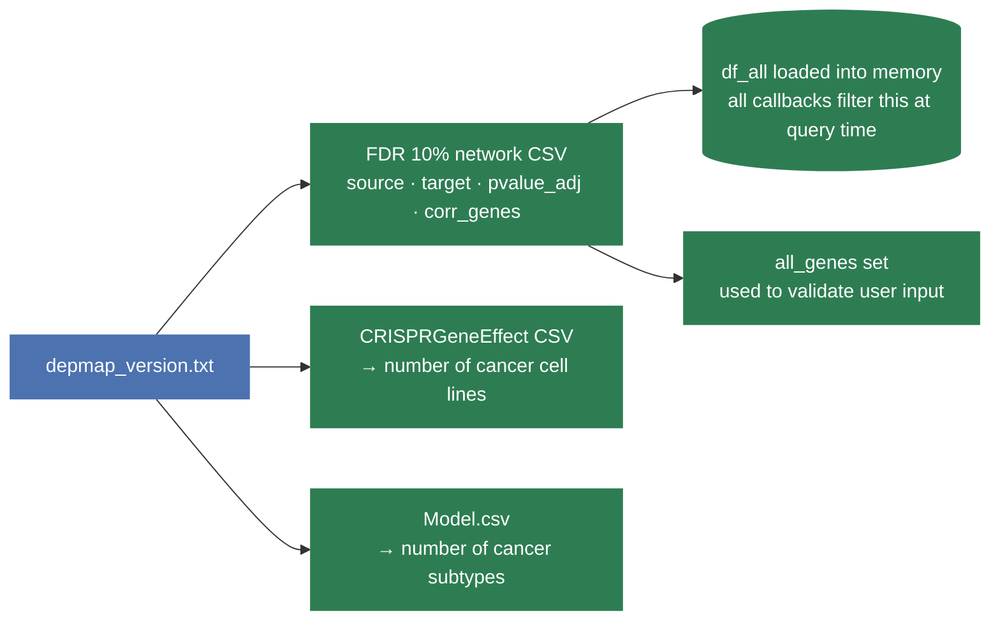
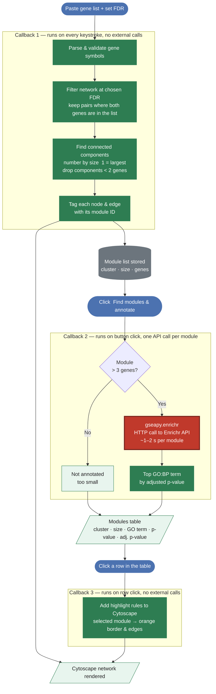
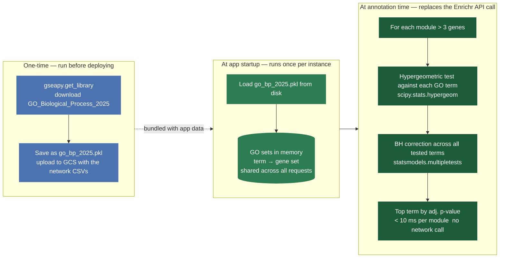

# Gene-List Network View — Workflow & GO:BP Annotation

The gene-list view lets users paste a set of gene symbols and explore how they are co-essentially connected. It groups connected genes into **co-essential modules**, then annotates each module with its most enriched GO Biological Process term.

---

## 1. App startup

Before any user interaction, the app loads everything it needs from disk. This runs once when the server boots.

---

## 2. Gene-list view — full workflow

The view is driven by **three callbacks** that fire at different points.

---

## 3. The GO:BP annotation problem

The red box in Callback 2 is a **live HTTP call to the Enrichr web API**. This is fine for local development but causes serious problems when the app is deployed to Google Cloud Platform.

| Problem | Impact |
|---|---|
| **One API call per module, sequential** | 5 modules × ~2 s = ~10 s blocking. Cloud Run has per-request timeouts — users with larger gene lists will hit them. |
| **Rate limits** | Enrichr limits queries per IP. Multiple concurrent users share one GCP outbound IP and will get throttled or 429 errors. |
| **External dependency** | If Enrichr is unavailable (maintenance, outage), GO annotation silently fails for all users. |
| **No caching** | The same GO:BP library is re-downloaded from Enrichr on every button click, even though it never changes between requests. |

---

## 4. The fix — local enrichment (planned for GCP deployment)

The GO:BP gene-set library is **static** — it only changes when Enrichr releases a new version. The enrichment test is just a **hypergeometric test + Benjamini–Hochberg correction**, which runs in milliseconds. There is no reason to call an external API at all.

### What changes in the code

Only the `annotate_multi_modules` callback in `coessentiality_feature_pc.py` needs updating — roughly a 10-line swap:

- **Remove:** `gp.enrichr(gene_list=..., gene_sets=..., organism=..., outdir=None)`
- **Replace with:** `_local_enrichr(gene_list, _GO_SETS, _GO_BACKGROUND)` using `scipy.stats.hypergeom` + `statsmodels` BH correction
- **Add at startup:** `_GO_SETS = _load_go_sets()` — loads `go_bp_2025.pkl` once, reused for every request

### Prototype vs production at a glance

| | Prototype (now) | Production (planned) |
|---|---|---|
| GO library source | Enrichr API, live per click | `.pkl` file, loaded at startup |
| Enrichment test | Remote (Enrichr server) | Local hypergeometric + BH |
| Speed | ~1–2 s per module | < 10 ms per module |
| Fails if Enrichr is down | Yes | No |
| Rate-limit risk on GCP | Yes | None |