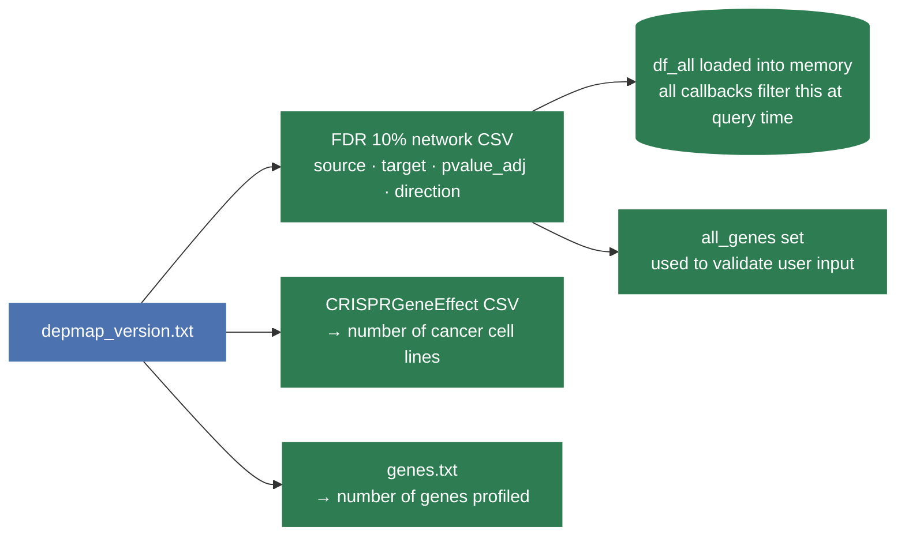
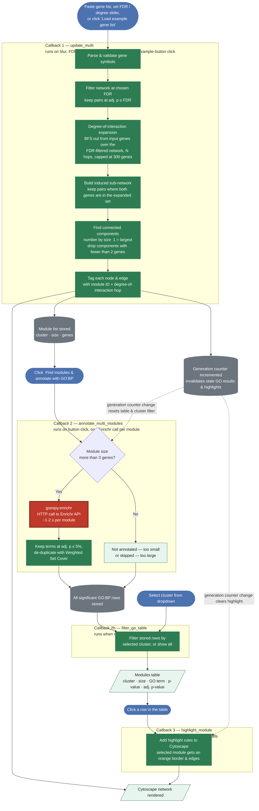
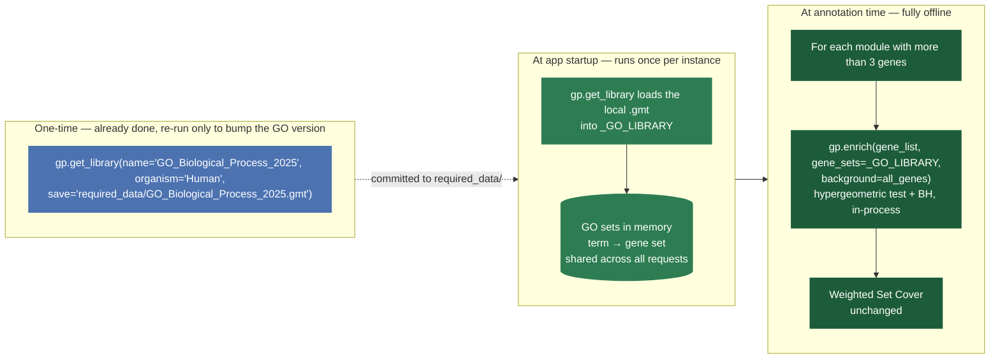

# Gene-List Network View — Workflow & GO:BP Annotation

The gene-list view lets users paste a set of gene symbols and explore how they are co-essentially connected. It can expand the network outward to nearby genes, groups connected genes into **co-essential modules**, and annotates each module with its significant, non-redundant GO Biological Process terms.

---

## 1. App startup

Before any user interaction, the app loads everything it needs from disk. This runs once when the server boots.

---

## 2. Gene-list view — full workflow

The view is driven by **four callbacks**.

---

## 3. Degree-of-interaction expansion

By default the network shows only pairs **between** the genes the user typed in. The **"Degree of interaction (N)" slider** (0–2) expands outward along co-essential edges:

- **0** (default): only the input genes and pairs among them.
- **1**: also include genes that are directly co-essential with at least one input gene.
- **2**: also include genes one further hop out from those.

Expansion is a breadth-first search over the FDR-filtered network, capped at 300 total genes (`MULTI_MAX_EXPANDED_GENES`) so the layout stays readable and the callback stays fast.

**Node colours:**

| Colour | Meaning |
|---|---|
| Near-black (`#222222`) | Input gene with at least one co-essential pair to another input gene |
| Light grey (`#D9D9D9`) | Input gene with no pair to another input gene (at the current FDR) |
| Light purple (`#D8BFD8`) | Gene added by degree-of-interaction expansion |

**Edge colours:** same blue/orange convention as the single-gene view — blue (`#0072B2`) for positive co-essentiality, orange (`#E69F00`) for negative — based on the sign of `direction`.

A **"Load example gene list"** button pre-fills the textarea with a curated set of DNA-damage-response genes (BRCA1, BRCA2, PALB2, RAD51, ATM, CHEK2, TP53, PTEN, RB1, FANCL, FANCA, FANCD2, FANCG, FANCI, MDM2, MDM4) so the network and module table can be explored without typing anything.

---

## 4. Co-essential modules & GO:BP annotation

Genes connected within the (possibly expanded) network are grouped into **co-essential modules** — connected components, numbered by size (1 = largest, ≥ 2 genes).

Clicking **"Find modules & annotate with GO:BP"**:

1. Skips modules with ≤ 3 genes (too small for a meaningful enrichment test) — shown in the table as "not annotated".
2. Skips modules larger than 200 genes (likely a giant-component artefact from a high degree-of-interaction setting) — shown as "skipped".
3. For all remaining modules (up to 10 per click, `MULTI_MAX_MODULES_TO_ANNOTATE`), runs a local hypergeometric enrichment test against `GO_Biological_Process_2025` (loaded once at startup from a local `.gmt` file, no network call) and keeps **every** term at adj. p ≤ 5%.
4. Removes redundant terms with a **greedy Weighted Set Cover**: terms are processed from most to least significant, and a term is dropped if ≥ 50% of its genes are already covered by a previously kept term — the same redundancy-reduction strategy WebGestalt uses by default. The result is a non-redundant set of representative GO:BP terms, one row per term per module.

A **cluster filter dropdown** ("All modules" or a specific module) narrows the table to one module's terms. Clicking a row in the table highlights that module's nodes/edges in the network above with an orange border.

> If the gene list, FDR, or degree-of-interaction slider changes after annotation, the module numbering may no longer match the table. The app detects this via an internal generation counter and automatically clears the GO:BP results, cluster filter, and any highlight — the user must click "Find modules & annotate" again.

---

## 5. CSV downloads

| Button | Tab | Contents |
|---|---|---|
| Download all partners (CSV) | Single-gene | Every co-essential partner of the selected gene at the chosen FDR — partner gene, p-value, adj. p-value, correlation, and a plain-English "co-essential / anti-correlated" note |
| Download pairs (CSV) | Gene-list | Every displayed pair, including any added by degree-of-interaction expansion, with each gene's hop distance and an "Original input pair" / "Degree-of-interaction pair" label |
| Download GO:BP terms (CSV) | Gene-list | The GO:BP terms currently shown in the modules table (respects the cluster filter), with each module's full gene list |

All three are generated on demand from the in-memory DataFrame — no extra file I/O.

---

## 6. GO:BP annotation runs locally — no Enrichr API calls

Earlier prototypes called `gp.enrichr(...)`, gseapy's wrapper around a **live HTTP
call to the Enrichr web API**, made once per module that needed annotating. That
caused real problems once deployed: Cloud Run per-request timeouts (up to 10
modules × ~1-2s = ~20s blocking), Enrichr's per-IP rate limits hitting all
concurrent GCP users at once (shared outbound IP), and a hard external-availability
dependency (if Enrichr is down, GO annotation silently fails for everyone).

This is now fixed: the GO:BP gene-set library is **static** — it only changes when
Enrichr repackages a new version (roughly every 1-2 years) — so there's no reason
to fetch it live per request. The library is downloaded **once**, ahead of time,
and the enrichment test itself (a hypergeometric test) runs entirely **offline**
against the local copy.

### What changed in the code

In `coessentiality_feature_pc.py`:

- **Module-level, loaded once at import:** `_GO_LIBRARY = gp.get_library(name=GO_GENE_SET_PATH)`,
  pointing at the local `required_data/GO_Biological_Process_2025.gmt`.
- **In `annotate_multi_modules`:** `gp.enrichr(gene_list=..., gene_sets=..., organism=..., outdir=None)`
  replaced with `gp.enrich(gene_list=..., gene_sets=_GO_LIBRARY, background=all_genes, outdir=None, no_plot=True)`.
  Same output schema (`Term` / `P-value` / `Adjusted P-value` / `Genes`), so
  `_weighted_set_cover()` and `_split_go_term()` needed no changes.
- **Background population is now the actual DepMap-profiled gene set** (`all_genes`,
  ~17,087 genes from `depmap_<version>_genes.txt`) instead of Enrichr's generic
  whole-genome default — the statistically correct background for a module derived
  from a CRISPR-screen co-essentiality network, not an unrelated side effect of the
  fix.

### Before vs after

| | Before | After |
|---|---|---|
| GO library source | Enrichr API, live per click | `.gmt` file, loaded once at startup |
| Enrichment test | Remote (Enrichr server) | Local hypergeometric (`gp.enrich`) |
| Background gene set | Enrichr default (whole genome) | DepMap-profiled genes (~17,087) |
| Redundancy filtering | Weighted Set Cover (already local) | Unchanged |
| Fails if Enrichr is down | Yes | No |
| Rate-limit risk on GCP | Yes | None |
