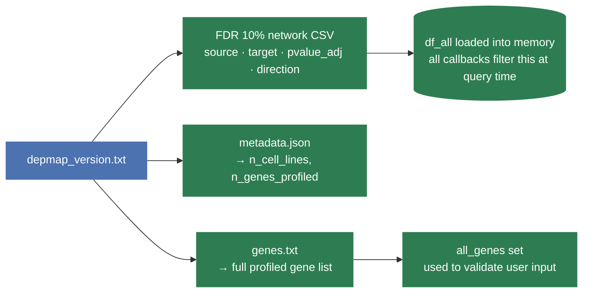
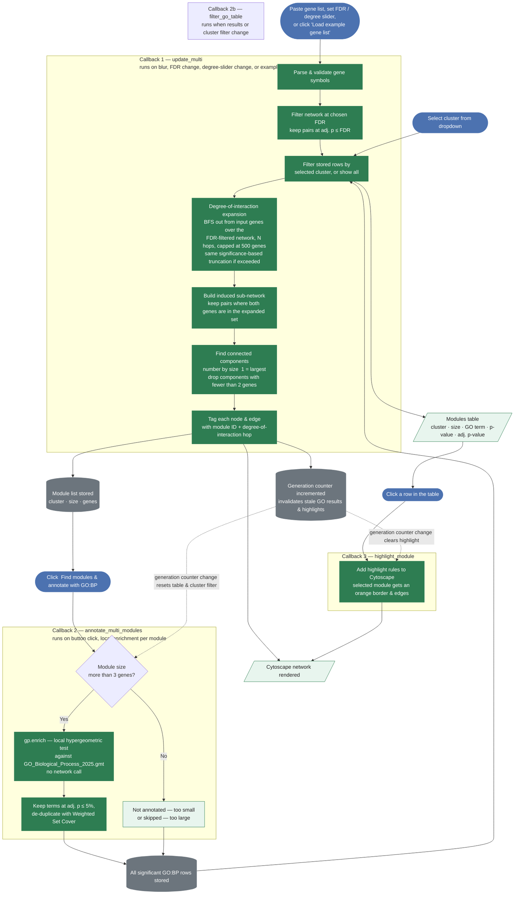

# Gene-List Network View — Workflow & GO:BP Annotation

The gene-list view lets users paste a set of gene symbols and explore how they are co-essentially connected. It can expand the network outward to nearby genes, groups connected genes into **co-essential modules**, and annotates each module with its significant, non-redundant GO Biological Process terms.

---

## 1. App startup

Before any user interaction, the app loads everything it needs from disk. This runs once when the server boots.

---

## 2. Gene-list view — full workflow

The view is driven by **four callbacks**.

---

## 3. Degree-of-interaction expansion

By default the network shows only pairs **between** the genes the user typed in. The **"Degree of interaction (N)" slider** (0–2) expands outward along co-essential edges:

- **0** (default): only the input genes and pairs among them.
- **1**: also include genes that are directly co-essential with at least one input gene.
- **2**: also include genes one further hop out from those.

Expansion is a breadth-first search over the FDR-filtered network. The total network size — the raw pasted input **and** any expansion — is capped at 500 genes (`MULTI_MAX_EXPANDED_GENES`) so the browser doesn't choke trying to render an oversized graph. This applies even at degree 0: pasting a very large gene list directly (with no expansion at all) is capped the same way, since rendering thousands of nodes can crash the page regardless of how they got there.

When truncation is needed, genes are kept **by statistical significance** — those involved in the most significant pairs (smallest adjusted p-value) within the candidate set survive first — rather than an arbitrary or random subset. A summary message ("Network truncated to the 500 most statistically significant genes...") appears whenever this happens. The "Download pairs (CSV)" button applies the same truncation, so the download always matches what's on screen.

**Node colours:**

| Colour | Meaning |
|---|---|
| Near-black (`#222222`) | Input gene |
| Light purple (`#D8BFD8`) | Gene added by degree-of-interaction expansion |

**Edge colours** (same blue/orange convention as the single-gene view, based on the sign of `direction`):

| Colour | Meaning |
|---|---|
| Blue (`#0072B2`) | Co-essential pair — both genes' essentiality scores move together across cell lines (perturbing either tends to impair fitness in the same lines) |
| Orange (`#E69F00`) | Anti-correlated pair — the two genes are mutually essential in opposite contexts (each tends to matter where the other doesn't) |

A **"Load example gene list"** button pre-fills the textarea with a curated set of DNA-damage-response genes (BRCA1, BRCA2, PALB2, RAD51, ATM, CHEK2, TP53, PTEN, RB1, FANCL, FANCA, FANCD2, FANCG, FANCI, MDM2, MDM4) so the network and module table can be explored without typing anything.

---

## 4. Co-essential modules & GO:BP annotation

Genes connected within the (possibly expanded) network are grouped into **co-essential modules** — connected components, numbered by size (1 = largest, ≥ 2 genes).

Clicking **"Find modules & annotate with GO:BP"**:

1. Skips modules with ≤ 3 genes (too small for a meaningful enrichment test) — shown in the table as "not annotated".
2. Skips modules larger than 200 genes (likely a giant-component artefact from a high degree-of-interaction setting) — shown as "skipped".
3. For all remaining modules (up to 10 per click, `MULTI_MAX_MODULES_TO_ANNOTATE`), runs a local hypergeometric enrichment test (`gp.enrich()`) against `GO_Biological_Process_2025` (loaded once at startup from a local `.gmt` file, no network call) using the actual DepMap-profiled gene set (`all_genes`, ~17,087 genes) as the statistical background, and keeps **every** term at adj. p ≤ 5%.
4. Removes redundant terms with a **greedy Weighted Set Cover**: terms are processed from most to least significant, and a term is dropped if ≥ 50% of its genes are already covered by a previously kept term — the same redundancy-reduction strategy WebGestalt uses by default. The result is a non-redundant set of representative GO:BP terms, one row per term per module.

**Runs entirely locally** — GO:BP annotation uses `GO_Biological_Process_2025.gmt` (loaded once at startup into memory), with no Enrichr API calls made at request time.

A **cluster filter dropdown** ("All modules" or a specific module) narrows the table to one module's terms. Clicking a row in the table highlights that module's nodes/edges in the network above with an orange border.

> If the gene list, FDR, or degree-of-interaction slider changes after annotation, the module numbering may no longer match the table. The app detects this via an internal generation counter and automatically clears the GO:BP results, cluster filter, and any highlight — the user must click "Find modules & annotate" again.

---

## 5. CSV downloads

| Button | Tab | Contents |
|---|---|---|
| Download all partners (CSV) | Single-gene | Every co-essential partner of the selected gene at the chosen FDR — partner gene, p-value, adj. p-value, correlation, and a plain-English "co-essential / anti-correlated" note |
| Download pairs (CSV) | Gene-list | Every displayed pair, including any added by degree-of-interaction expansion, with each gene's hop distance and an "Original input pair" / "Degree-of-interaction pair" label |
| Download GO:BP terms (CSV) | Gene-list | The GO:BP terms currently shown in the modules table (respects the cluster filter), with each module's full gene list |

All three are generated on demand from the in-memory DataFrame — no extra file I/O.
