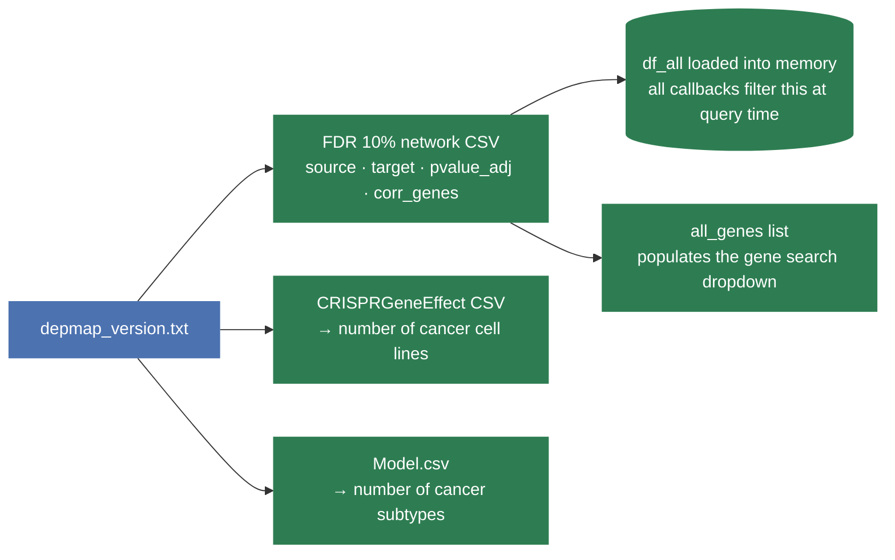
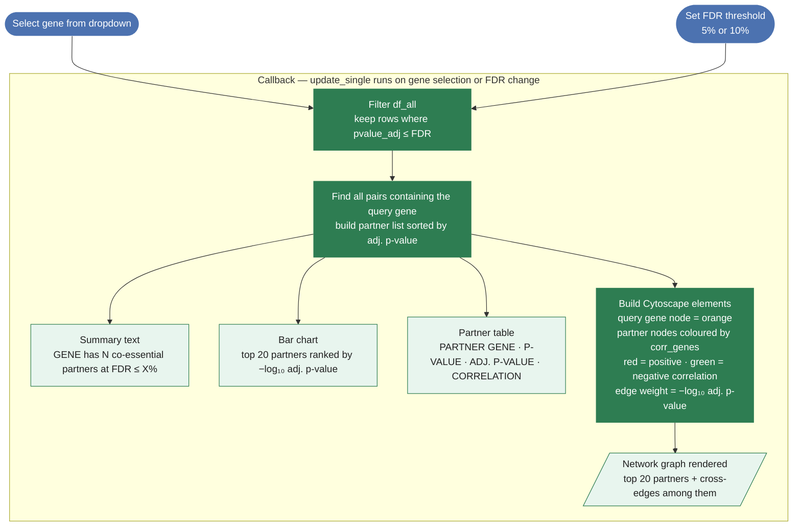
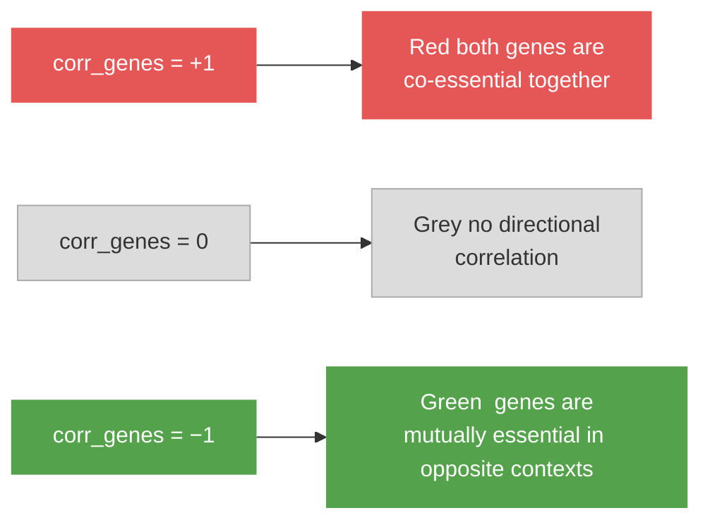

# Single-Gene Explorer — Workflow

The single-gene explorer lets users search for one gene and see all its co-essential partners — ranked by significance, coloured by correlation, and laid out as a network graph.

---

## 1. App startup

Before any user interaction, the app loads everything it needs from disk. This runs once when the server boots.

---

## 2. Single-gene view — full workflow

The entire view is driven by a **single callback** that fires whenever the user picks a gene or changes the FDR threshold.

---

## 3. How node colours are computed

Partner nodes are coloured on a **red → grey → green** gradient based on their `corr_genes` value — the sign of the co-essentiality relationship with the query gene.

The query gene itself is always shown in **orange** to distinguish it from its partners.

---

## 4. Notes

- All computation is **local and instantaneous** — no external API calls are made in the single-gene view.
- The FDR dropdown is shared across both tabs; changing it updates the single-gene view and the gene-list view simultaneously.
- The bar chart and table both show all partners at the chosen FDR; the Cytoscape graph is capped at the **top 20** to keep the layout readable.
- For the gene-list view (Tab 2) and its GO:BP annotation workflow, see `gene_list_workflow.md`.