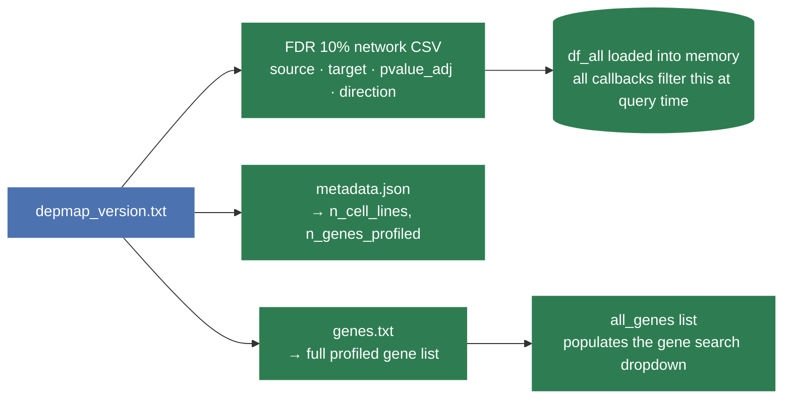
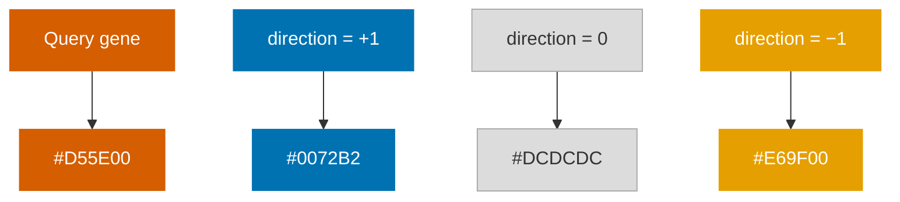

# Single-Gene Explorer — Workflow

The single-gene explorer lets users search for one gene and see all its co-essential partners — ranked by significance, coloured by direction, and laid out as a network graph.

---

## 1. App startup

Before any user interaction, the app loads everything it needs from disk. This runs once when the server boots.



---

## 2. Single-gene view — full workflow

The entire view is driven by a **single callback** that fires whenever the user picks a gene, changes the FDR threshold, or clicks a sortable column header on the partner table.

```mermaid
flowchart TD

classDef user  fill:#4C72B0,color:#fff,stroke:none,rx:16
classDef fast  fill:#2E7D52,color:#fff,stroke:none
classDef out   fill:#E8F5EE,color:#212121,stroke:#2E7D52

A([Select gene from dropdown]):::user
B([Set FDR threshold\n5% or 10%]):::user
S([Click a sortable column header]):::user

subgraph CB["Callback — update_single  runs on gene selection, FDR change, or sort_by change"]
    direction TB
    C[Filter df_all\nkeep rows where pvalue_adj ≤ FDR]:::fast
    D[Find all pairs containing the query gene\nbuild partner list, default sort by adj. p-value]:::fast
    C --> D
    R[Custom sort: re-order by the real underlying\nfield the clicked column represents\n— not the rendered HTML markup]:::fast
    D --> R

    R --> E[Summary text\nGENE has N co-essential partners at FDR ≤ X%]:::out
    R --> G[Partner table — single table, one row per gene\nPARTNER GENE · DIRECTION badge · GLS P-VALUE · STATISTICAL CONFIDENCE bar\n+ a synthetic last row rendering a -log10(FDR) ruler\naligned under the confidence bars]:::out
    R --> H[Build Cytoscape elements\nquery gene node = dark orange\npartner nodes coloured by direction\nblue = positive · orange = negative co-essentiality\nedge weight = −log₁₀ adj. p-value]:::fast
    H --> I[/Network graph rendered\ntop 20 partners + cross-edges among them/]:::out
end

A --> C
B --> C
S --> R
```

A small separate callback (`set_example_gene`) wires the **TP53 / BRCA1 / KRAS** quick-search buttons next to the dropdown — clicking one just sets the gene-dropdown value, which then triggers the callback above as normal.

### Why sorting is server-side

DIRECTION and STATISTICAL CONFIDENCE render HTML (badge/bar), not plain values — Dash's native sort would order them by markup text, not the real value. `sort_by` is wired as a callback input instead, so clicking a header re-sorts the underlying data by the real field first.

### The Statistical Confidence axis

The bar's fill length is on a **fixed, labelled `−log₁₀(FDR)` scale** (rounded up to a "nice" number — 10, 20, 30, 40, 50, 75...— above the gene's own strongest partner), not a percentage relative to that gene's best p-value. A ruler (axis line, 5 tick marks at 0/25/50/75/100% of that scale, and a centred `−log₁₀(FDR)` caption underneath) is appended as the table's own **synthetic last row**, not a separate sibling element — a sibling row built from scratch can drift out of pixel alignment with the real bars (the bar's track shares its flex row with a trailing confidence-value label, so it's narrower than the full column); reusing the literal same column of the literal same table guarantees the ruler always lines up with the bars above it.

---

## 3. How node colours are computed

Partner nodes are coloured on a **blue → grey → orange** gradient based on their `direction` value — the sign of the co-essentiality relationship with the query gene. Same colours as the Direction badge in the partner table, so colour means the same thing everywhere in the app.



| | Meaning |
|---|---|
| `#D55E00` | Query gene (dark orange — a different shade from the anti-correlated colour below, so it's never confused with a partner) |
| `#0072B2` | Co-essential pair — both genes' essentiality scores move together across cell lines (perturbing either tends to impair fitness in the same lines) |
| `#DCDCDC` | Neutral, no directional correlation |
| `#E69F00` | Anti-correlated pair — the two genes are mutually essential in opposite contexts (each tends to matter where the other doesn't) |

The palette is from Wong (2011) and is colourblind-safe — kept deliberately separate from the Perturbation Catalogue brand green/red, since green+red is a difficult pair for red-green colourblindness.

---

## 4. Notes

- All computation is **local and instantaneous** — no external API calls are made in the single-gene view.
- The FDR dropdown is shared across both tabs; changing it updates the single-gene view and the gene-list view simultaneously.
- The partner table shows all partners at the chosen FDR (paginated, 15 rows per page, plus the axis ruler row); the Cytoscape graph is capped at the **top 20** to keep the layout readable.
- Any column can be sorted by clicking its header — including DIRECTION and STATISTICAL CONFIDENCE, which sort by the real underlying value (not the rendered badge/bar markup).
- The Statistical Confidence bar's length means **confidence, not biological effect size** — GLS doesn't report a true effect-size statistic, only a p-value for how confident we are the relationship is real. The axis caption and column header are deliberately worded around "confidence," not "strength."
- The **"Download all partners (CSV)"** button (enabled once a gene is selected) exports the *full* partner list at the current FDR — not just the top 20 shown in the network graph — with a plain-English "co-essential / anti-correlated" note per row.
- For the gene-list view (Tab 2) and its GO:BP annotation workflow, see `gene_list_workflow.md`.