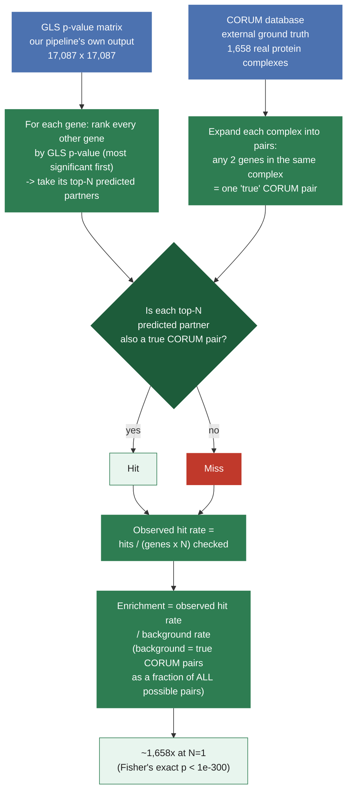

# CORUM Validation Results — GLS Co-essentiality Pipeline

Validation for [PR #365](https://github.com/EMBL-EBI-ABC/PerturbationCatalogue/pull/365)
Comment 4 ("we need *some* sort of benchmark which takes pipeline results as
input and produces a numerical metric"). Replicates the spirit of Wainberg et
al.'s Figure 2 / Extended Data Figure 4 ("GLS improves recall of known
functional interactions in co-essential gene pairs").

## What this answers

> "After we run this pipeline, does it produce sensible results — and is GLS
> still a relevant method on today's data?"

## The validation, visually

Two completely independent inputs feed into one check: does GLS's own
ranking agree with ground truth (CORUM) that has nothing to do with DepMap,
CRISPR, or our pipeline?



In plain terms: take GLS's own predictions, check them against an answer key
GLS never saw, and measure how much better than a random guess GLS does.

## Method

1. **Gold standard:** Enrichr's `CORUM` gene-set library (1,658 human protein
   complexes, fetched via `gseapy.get_library()`). Every pair of genes that
   co-occur in the same complex is treated as a "true" co-essential-like pair.
2. **Ranking:** for every gene with at least one CORUM complex-mate present
   in our 17,087-gene panel, rank all other genes by GLS p-value (ascending)
   and take its top-N partners, for N = 1 to 10.
3. **Metric ("enrichment"):**

   ```
   enrichment(N) = (% of top-N pairs that are true CORUM pairs)
                 / (% of all possible pairs that are true CORUM pairs)
   ```

   `1.0` = GLS ranking is no better than random.

Data used: `depmap_26Q1_GLS_p.npy` / `depmap_26Q1_genes.txt` (current
production pipeline output, 17,087 genes, post-Comment-5 fix).

## Results

- **N** — how many of GLS's top-ranked predicted partners we're checking, per
  gene (e.g. N=1 means "just the single best-ranked partner"; N=10 means
  "anywhere in the top 10").
- **Observed hit rate** — of all the (evaluated gene, top-N predicted
  partner) checks performed, what fraction actually are true CORUM
  complex-mates.
- **Enrichment vs. chance** — `Observed hit rate ÷ background rate`. `1.0x`
  would mean GLS's top-N predictions are no better than picking N random
  genes; higher means GLS is finding real signal.

| N (top-N partners) | Observed hit rate | Enrichment vs. chance |
|---:|---:|---:|
| 1 | 26.93% | **1,657.6x** |
| 2 | 23.49% | 1,446.0x |
| 3 | 20.93% | 1,288.3x |
| 4 | 18.63% | 1,146.8x |
| 5 | 16.92% | 1,041.4x |
| 6 | 15.51% | 955.0x |
| 7 | 14.35% | 883.3x |
| 8 | 13.36% | 822.7x |
| 9 | 12.47% | 767.8x |
| 10 | 11.74% | 722.6x |

- **Genes evaluated:** 2,284 (genes with ≥1 CORUM complex-mate inside our panel)
- **Background rate:** 0.0162% (23,713 true CORUM pairs out of 145,974,241
  total possible pairs among our 17,087 genes)

At N=1, GLS's single most-significant predicted partner for a gene is its
*actual* known complex-mate **26.9% of the time** — roughly **1,658x
enrichment over random chance**.

## Side-by-side comparison with Wainberg et al. (2021)

The paper reports its own CORUM enrichment number directly in the text:

> "the top-ranked partners for each gene are approximately **160-fold**
> enriched for CORUM interactions for GLS, compared with 120-fold for
> bias-corrected Pearson's correlation."

| | Wainberg et al. (2021) | This pipeline (2026) |
|---|---|---|
| DepMap data | CERES, 485 cell lines, 18Q3 | Chronos, 1,208 cell lines, 26Q1 |
| Gold standard | CORUM | CORUM |
| Enrichment at top rank | ~160-fold | **~1,658-fold** |

**GLS is still highly relevant on today's data — if anything, more so than in
2021.** Our enrichment is roughly 10x stronger than the original published
result, on a newer DepMap release with over twice the cell lines.

## Files

- `corum_validation.ipynb` — the notebook that produced this (run top to
  bottom to reproduce the table and chart)
- `CORUM.gmt` — cached gold-standard data (pinned snapshot, same
  not-auto-updated philosophy as `GO_Biological_Process_2025.gmt`)
