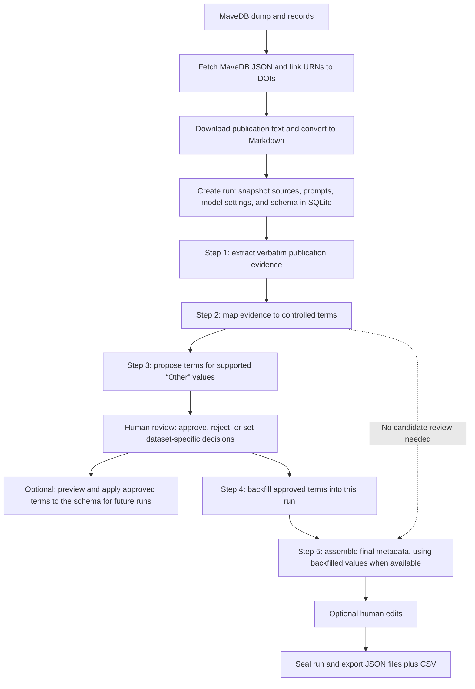
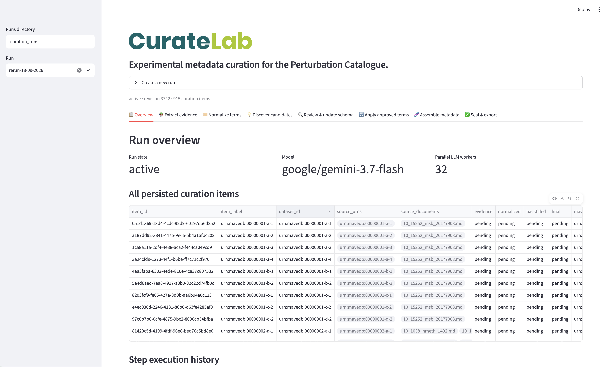

# LLM-Assisted Study Metadata Curation

See the [study curation overview](../README.md) for the complete workflow and directory layout.

This workflow turns publication text and MaveDB records into reviewed, schema-aligned
study metadata. Each batch is a named, resumable run: source files, prompts,
model settings, and the schema are snapshotted into a SQLite database, alongside
individual step results and review history.

## Workflow at a glance

The dashboard is the recommended way to run the workflow: it brings run
creation, step execution, candidate review, and final edits into one interface.
The CLI is available for scripted or mixed workflows; candidate review and
final-field edits are handled in the dashboard.



1. **Prepare sources.** Make publication Markdown, MaveDB metadata JSON, and a
   URN-to-DOI mapping available.
2. **Create a run.** The run snapshots its inputs, prompts, model settings, and
   schema so later changes to source caches do not alter it.
3. **Extract and normalize (Steps 1–2).** Step 1 extracts publication evidence;
   Step 2 maps it to controlled terms. Step 3 is optional and proposes terms
   for evidence-supported values normalized to `Other`.
4. **Review candidates when needed.** In the dashboard, approve, reject, or set
   dataset-specific decisions. You can optionally apply approved terms to the
   shared schema for future runs; this run continues to use its schema snapshot.
5. **Backfill and assemble (Steps 4–5).** Step 4 applies approved mappings to
   this run. Step 5 uses backfilled results when available, or Step 2 normalized
   results directly when no candidate review is needed.
6. **Finalize.** Final-field edits are optional. Seal the run, then export the
   deliverables.

## Before you start

Run commands from the repository root with the project virtual environment and
the `data_exploration` package path enabled:

```bash
source .venv/bin/activate
export PYTHONPATH=data_exploration
```

Repeat these setup commands in any new terminal you open for the dashboard.

The default model is `google/gemini-3.7-flash` through Vertex AI. Configure
Vertex AI credentials for the environment before running LLM steps.

The default source-cache locations are:

| Input                | Path                                                                      |
| -------------------- | ------------------------------------------------------------------------- |
| Publication Markdown | `data_exploration/curation_cache/publications/markdown`    |
| MaveDB metadata JSON | `data_exploration/curation_cache/mavedb/metadata`         |
| URN-to-DOI mapping   | `data_exploration/curation_cache/mavedb/urn_to_dois.json` |

If you need to build or refresh these caches, run the collection pipeline from
the repository's MaveDB dump. Skip this when the cache files are already ready:

```bash
python -m curation_tools.study_curation.sources.mavedb
```

## Run from the dashboard (recommended)

Start the GUI dashboard from the repository root in an activated environment:

```bash
source .venv/bin/activate
export PYTHONPATH=data_exploration
streamlit run data_exploration/curation_tools/study_curation/llm/review_gui.py
```



In the browser:

1. Set the runs directory in the sidebar to the same location used by the CLI,
   or keep the default `curation_runs` in both.
2. Expand **Create a new run**, enter the three source-cache paths, choose a
   run name and model settings, then select **Snapshot inputs and create run**.
3. Select the run in the sidebar. Run Steps 1 and 2. Run Step 3 when you want
   candidate-term suggestions for evidence-supported `Other` values.
4. If candidates are produced, use **Review & update schema** to approve,
   reject, or set dataset-specific decisions. Applying approved terms to the
   shared schema is optional and affects future runs; the current run keeps its
   schema snapshot.
5. Run Step 4 when you want approved mappings backfilled into this run. Run
   Step 5 to assemble final metadata from the backfilled results when available,
   or from Step 2 output otherwise. If no review or backfill is needed, skip
   Steps 3 and 4 and run Step 5 after Step 2.
6. Review final records and append any needed edits. Open **Seal & export** to
   seal the run and write the JSON and CSV files.

The CLI and dashboard use the same run database, so you can switch between
them. The dashboard provides candidate decisions and final-field editing; the
CLI provides `create`, `step`, `status`, `seal`, and `export` commands.

## Run from the command line

Choose a unique run name; a new run cannot reuse an existing name. The default
run directory is `curation_runs/<run-name>/`.

```bash
export CURATION_RUN=my-new-run  # replace with a unique run name

python -m curation_tools.study_curation.llm.run_cli create \
  --run-name "$CURATION_RUN" \
  --publication-dir data_exploration/curation_cache/publications/markdown \
  --mavedb-metadata-dir data_exploration/curation_cache/mavedb/metadata \
  --urn-to-dois-file data_exploration/curation_cache/mavedb/urn_to_dois.json
```

Run Steps 1 and 2 first. These produce the evidence and normalized
artifacts. Completed item work is skipped if you rerun a step.

```bash
python -m curation_tools.study_curation.llm.run_cli step --run "$CURATION_RUN" --step step1
python -m curation_tools.study_curation.llm.run_cli step --run "$CURATION_RUN" --step step2
```

Step 3 is optional. Run it when normalized output contains evidence-supported
`Other` values for which you want candidate-term suggestions:

```bash
python -m curation_tools.study_curation.llm.run_cli step --run "$CURATION_RUN" --step step3
```

If Step 3 creates candidates, review them in the dashboard. In **Review &
update schema**, approve, reject, or set dataset-specific decisions. Applying
approved terms to the shared schema affects future runs; this run continues to
use its schema snapshot.

Run Step 4 when you want approved mappings backfilled into this run:

```bash
python -m curation_tools.study_curation.llm.run_cli step --run "$CURATION_RUN" --step step4
```

Run Step 5 to assemble final metadata. It uses Step 4 backfilled results when
available and Step 2 normalized results otherwise. If no candidate review or
backfill is needed, skip Steps 3 and 4 and run Step 5 directly after Step 2:

```bash
python -m curation_tools.study_curation.llm.run_cli step --run "$CURATION_RUN" --step step5
```

Inspect run state and execution history at any time:

```bash
python -m curation_tools.study_curation.llm.run_cli status --run "$CURATION_RUN"
```

Once final artifacts are ready and no step is running, seal the run and export
the deliverables:

```bash
python -m curation_tools.study_curation.llm.run_cli seal --run "$CURATION_RUN"
python -m curation_tools.study_curation.llm.run_cli export \
  --run "$CURATION_RUN" \
  --output-dir "curation_runs/$CURATION_RUN/exports"
```

The export directory must be empty or absent. Pass `--overwrite` to replace a
non-empty destination. Sealing closes the run to further curation edits;
status inspection and explicit export remain available.

To retry incomplete items from the latest failed execution, rerun that step with
`--retry-failed`. For example, to retry a failed Step 1 execution:

```bash
python -m curation_tools.study_curation.llm.run_cli step \
  --run "$CURATION_RUN" \
  --step step1 \
  --retry-failed
```

To use a different run root, pass `--runs-root PATH` **before** the CLI
subcommand, for example:

```bash
python -m curation_tools.study_curation.llm.run_cli --runs-root /data/curation-runs status \
  --run "$CURATION_RUN"
```

## Run data and outputs

Each run is stored at
`curation_runs/<run-name>/curation_run.sqlite3`. The database keeps source
snapshots, configuration, step executions, artifacts, review decisions,
append-only final edits, and event history. JSON and CSV deliverables are
written only when you explicitly export a sealed run.
